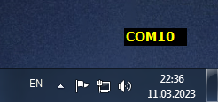

# COMVIEW

An Windows application for displaying a list of available COM ports on the screen.
After opening the application, you can move it to the desired location on the screen.
Color setting is available from the context menu.
